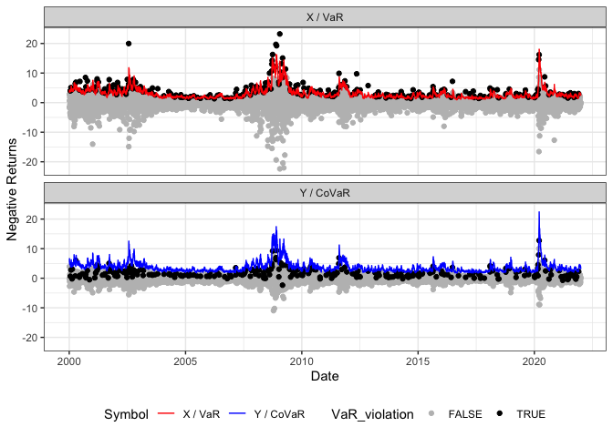

<!-- README.md is generated from README.Rmd. Please edit that file -->

# CoQR

<!-- badges: start -->
<!-- badges: end -->

The CoQR package fits a dynamic Co-Quantile Regression in the sense that
it semiparametrically models the Value at Risk (VaR), i.e., the
-quantile
of

jointly with the
-CoVaR
of a series

given
.

## Installation

You can install the development version of CoQR from
[GitHub](https://github.com/) with:

``` r
# install.packages("devtools")
devtools::install_github("TimoDimi/CoQR")
```

## Example

This is a basic example which shows you how to solve a common problem:

``` r
library(quantmod)
#> Warning: Paket 'quantmod' wurde unter R Version 4.1.2 erstellt
#> Lade nötiges Paket: xts
#> Lade nötiges Paket: zoo
#> 
#> Attache Paket: 'zoo'
#> Die folgenden Objekte sind maskiert von 'package:base':
#> 
#>     as.Date, as.Date.numeric
#> Lade nötiges Paket: TTR
#> Registered S3 method overwritten by 'quantmod':
#>   method            from
#>   as.zoo.data.frame zoo
library(dplyr)
#> 
#> Attache Paket: 'dplyr'
#> Die folgenden Objekte sind maskiert von 'package:xts':
#> 
#>     first, last
#> Die folgenden Objekte sind maskiert von 'package:stats':
#> 
#>     filter, lag
#> Die folgenden Objekte sind maskiert von 'package:base':
#> 
#>     intersect, setdiff, setequal, union
library(CoQR)


# Get data from Yahoo Finance
data_Symbols <- lapply(c("JPM", "^GSPC"), function(x) {
  getSymbols(x,
             from = "2000/01/01",
             to = "2022/05/25",
             periodicity = "daily",
             auto.assign = FALSE) %>%
    data.frame(Date=index(.), check.names=FALSE) %>%
    tibble::as_tibble() %>%
    rename_all(~stringr::str_replace_all(., paste0(x,"."), ""))
})
names(data_Symbols) <- c("JPM", "SP500")

data_Assets <- bind_rows(data_Symbols, .id = "Asset") %>%
  dplyr::group_by(Asset) %>%
  dplyr::mutate(Date=lubridate::as_date(Date),
         NegReturn= -100*(log(Close) - log(lag(Close)))) %>%
  dplyr::select(Date, Asset, NegReturn) %>%
  na.omit()

# Fit a CoCAViaR model
CoCAViaR_obj <- CoQR(x=data_Assets %>% filter(Asset=="JPM") %>% pull(NegReturn),
                     y=data_Assets %>% filter(Asset=="SP500") %>% pull(NegReturn),
                     z=NULL, 
                     model="CoCAViaR_SAV_fullA", 
                     SRM="CoVaR", 
                     beta=0.95, 
                     alpha=0.95)

# Get standard errors and print its summary
summary(CoCAViaR_obj)
#> 
#> VaR Coefficients:
#>             Estimate Std. Error t value  Pr(>|t|)    
#> (Intercept) 0.048858   0.168621  0.2897 0.7720201    
#> lag |X|     0.157323   0.045067  3.4908 0.0004852 ***
#> lag |Y|     0.148553   0.112470  1.3208 0.1866163    
#> lag VaR     0.868650   0.068149 12.7464 < 2.2e-16 ***
#> 
#> CoVaR Coefficients:
#>             Estimate Std. Error t value  Pr(>|t|)    
#> (Intercept)  0.25411    0.61375  0.4140   0.67888    
#> lag |X|      0.12149    0.16581  0.7327   0.46376    
#> lag |Y|      0.37166    0.22560  1.6474   0.09952 .  
#> lag CoVaR    0.79619    0.19885  4.0040 6.307e-05 ***
#> ---
#> Signif. codes:  0 '***' 0.001 '**' 0.01 '*' 0.05 '.' 0.1 ' ' 1

# Plot
plot(CoCAViaR_obj)
```



``` r
## basic example code
```

You’ll still need to render `README.Rmd` regularly, to keep `README.md`
up-to-date. `devtools::build_readme()` is handy for this. You could also
use GitHub Actions to re-render `README.Rmd` every time you push. An
example workflow can be found here:
<https://github.com/r-lib/actions/tree/v1/examples>.
